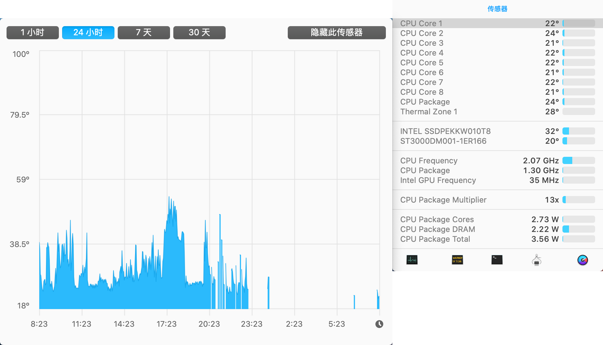
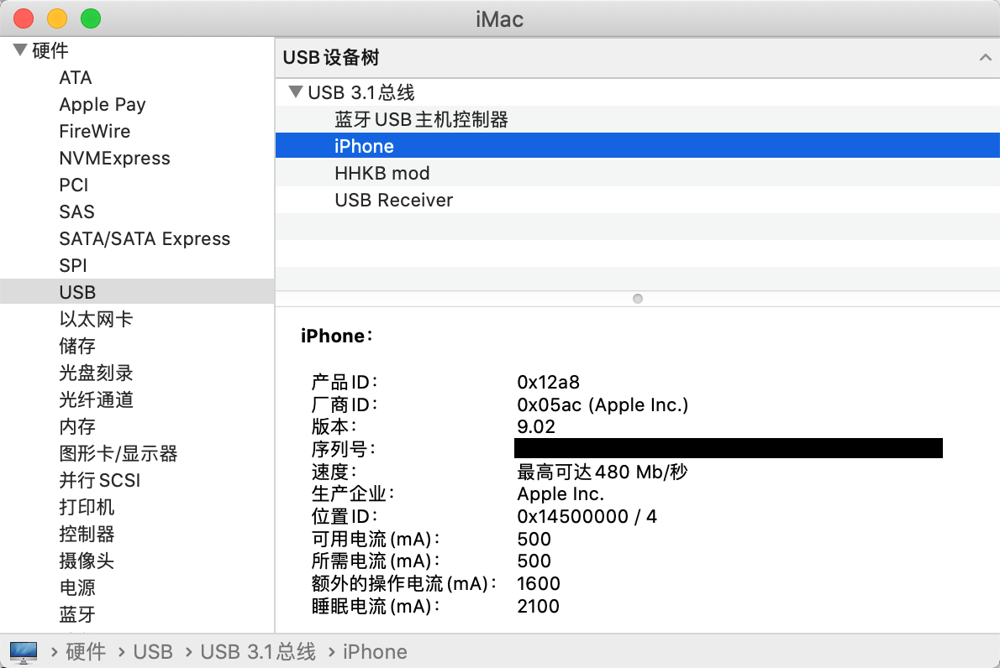
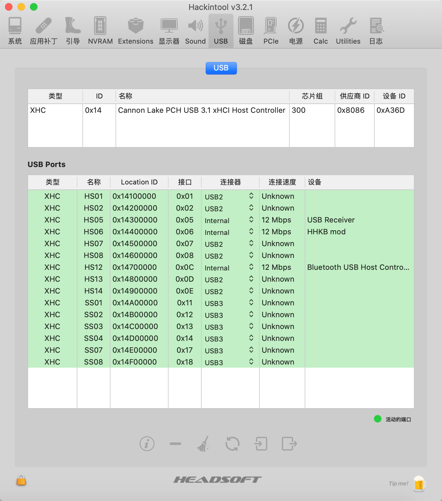
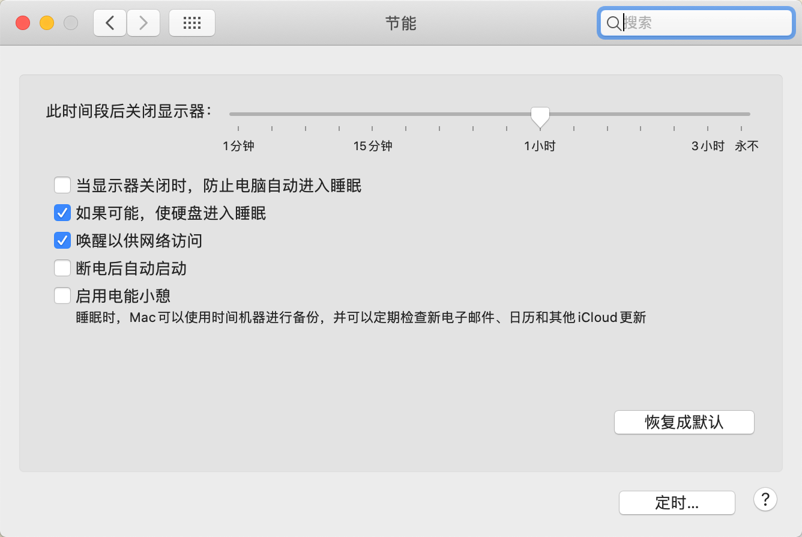
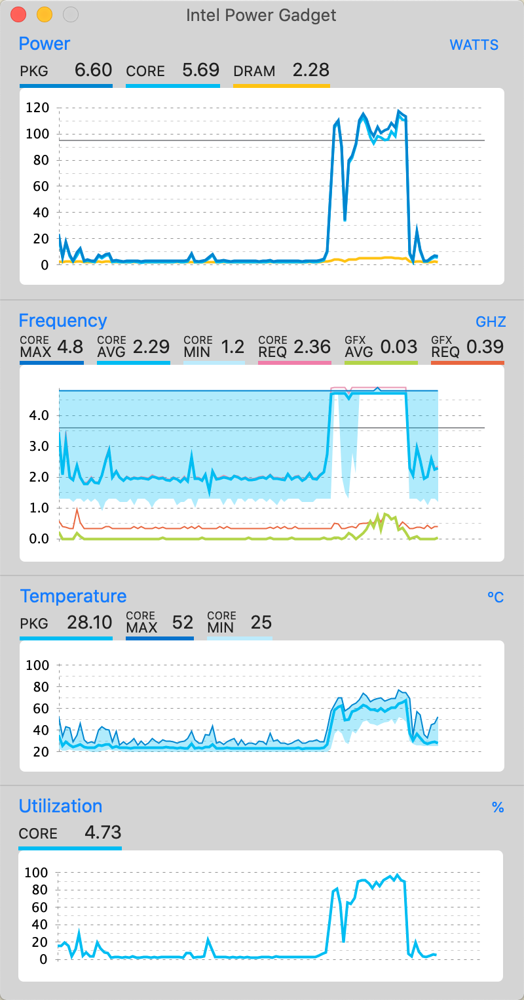

# Hackintosh Catalina Guide for ROG Strix Z390-H Gaming (OpenCore)

This build is "Vanilla". I used [this guide](https://dortania.github.io/OpenCore-Install-Guide/) as a starting point.

## Hardware
See my [Hardware List](HARDWARE.md)

## OpenCore
0.6.0

## MacOS
10.15.6 (19G73)

## How to use
generate PlatformInfo value yourself

## What's Working

- [x] Display
    - [x] Intel UHD Graphics 630 (DP)
    
- [x] Ethernet
- [x] Sleep/Wake

- [x] Bluetooth & Wi-Fi
    - [x] Airdrop
    - [x] Handoff & Continuity
- [x] USB ports
    - [x] iPhone fast charging
    
    - [x] custom usb ports
    
    
- [x] CPU Frequency

Others not tested is what I do not used.

## BIOS setting
see [Intel BIOS settings](https://dortania.github.io/OpenCore-Desktop-Guide/config.plist/coffee-lake.html#intel-bios-settings)
 - DVMT Pre-Allocated -> `192M`
 - Fast Boot -> `disable`

If you have an optimization plan, it would be nice if you let me know so I can improve the EFI. 
