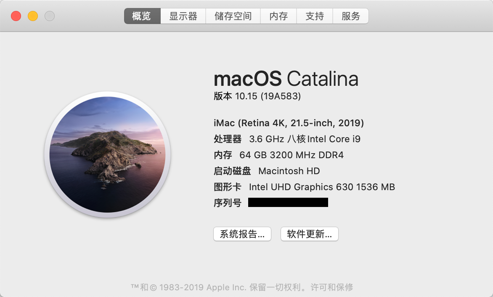

## Hardware
See my [Hardware List](HARDWARE.md)

## What's Working

- [x] Display
    - [x] Intel UHD Graphics 630 (DP)
- [x] Ethernet
- [x] Sleep/Wake
- [x] Bluetooth & Wi-Fi
    - [x] Airdrop
    - [x] Handoff
- [x] All USB ports (USB 3 speed working)

Others not tested is what I do not used.

## Software
- [Clover Installer](https://github.com/Dids/clover-builder/releases)
- [Clover Configurator](https://mackie100projects.altervista.org/download-clover-configurator/)
- [FakeSMC.kext](https://bitbucket.org/RehabMan/os-x-fakesmc-kozlek/downloads/)
- [Lilu.kext](https://github.com/acidanthera/Lilu/releases)
- [WhateverGreen.kext](https://github.com/acidanthera/WhateverGreen/releases)
- [USBInjectAll.kext](https://bitbucket.org/RehabMan/os-x-usb-inject-all/downloads/)
  - [XHCI-unsupported.kext](https://github.com/RehabMan/OS-X-USB-Inject-All)
- [IntelMausiEthernet.kext](https://bitbucket.org/RehabMan/os-x-intel-network/downloads/)
- [AppleALC.kext](https://github.com/acidanthera/AppleALC/releases)

## PS
EFI-INSTALL is used in my first installation, and it given from the author of [this article](http://bbs.pcbeta.com/forum.php?mod=viewthread&tid=1816236)
